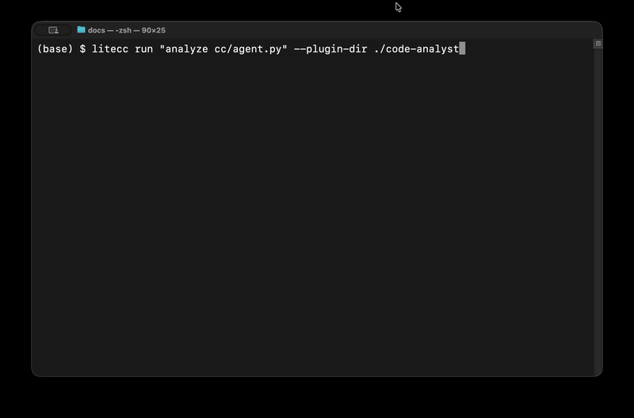

<p align="center">
  <h1 align="center">lite-cc</h1>
  <p align="center">
    A minimal, multi-model coding agent runtime for the terminal.
  </p>
</p>

<p align="center">
  <a href="#quick-start">Quick Start</a> &middot;
  <a href="#how-it-works">How It Works</a> &middot;
  <a href="#plugins--skills">Plugins & Skills</a> &middot;
  <a href="#configuration">Configuration</a> &middot;
  <a href="#safety">Safety</a>
</p>

---

<p align="center">
  
</p>

**lite-cc** (`litecc`) is a lightweight, provider-agnostic coding agent for the terminal. It connects to any LLM via [LiteLLM](https://docs.litellm.ai/docs/providers), runs an autonomous tool loop, and extends its capabilities through plugins and skills.

## Key Features

- **Multi-model** — OpenAI, Anthropic, OCI, Gemini, Groq, Ollama, and [any provider LiteLLM supports](https://docs.litellm.ai/docs/providers).
- **Autonomous tool loop** — Reasons, calls tools, observes results, and iterates until the task is done.
- **Claude Code plugin compatible** — Load plugins and skills using the same format as Claude Code. Skills are loaded on demand to keep context lean.
- **Safe by default** — Dangerous commands are blocked. File access is scoped to the project directory. Fully autonomous, no prompts.
- **Structured output** — Colored, timestamped progress logs show exactly what the agent is doing.

## Quick Start

```bash
# Install from PyPI
pip install lite-cc

# Or with uv
uv pip install lite-cc

# Or install from source
git clone https://github.com/key4ng/lite-cc.git
cd lite-cc && pip install -e .
```

```bash
# Run
litecc run "list all Python files and describe what each one does"

# Run with a plugin
litecc run "analyze cc/agent.py" --plugin-dir examples/code-analyst
```

Output:

```
14:32:05 [litecc]  Using model: gpt-5.2
14:32:05 [litecc]  Starting task...
14:32:06 [tool]    list_files: **/*.py
14:32:07 [tool]    read_file: cc/agent.py
14:32:08 [gpt-5.2] I'll describe each file...
14:32:09 [litecc]  Here are the Python files...
```

## How It Works

```
litecc run "fix the failing tests"
        │
        ▼
  Load config, plugins, skills
        │
        ▼
  Build system prompt + tool definitions
        │
        ▼
  ┌─ Agent Loop ──────────────────────────┐
  │  1. Send messages + tools to LLM      │
  │  2. LLM returns tool calls            │
  │     → execute safely → append results │
  │  3. LLM returns text → done           │
  └───────────────────────────────────────┘
```

The loop runs until the model produces a final answer or hits the max iteration limit.

## Usage

```bash
# Basic task
litecc run "fix the failing tests"

# Choose a model
litecc run "refactor this module" --model anthropic/claude-3-sonnet-20240229

# Load plugins
litecc run "triage the latest ticket" --plugin-dir ~/my-plugin
litecc run "check health" --plugin-dir ~/plugin-a --plugin-dir ~/plugin-b

# Different project directory
litecc run "explain the architecture" --project-dir ~/other-repo

# Verbose output (show tool results, full reasoning)
litecc run "explore the codebase" -v

# Limit iterations
litecc run "explore the codebase" --max-iterations 20
```

<details>
<summary>CLI Reference</summary>

```
Usage: litecc run [OPTIONS] PROMPT

Options:
  --plugin-dir TEXT      Plugin directory (repeatable)
  --model TEXT           LiteLLM model string
  --max-iterations INT   Max tool loop iterations (default: 50)
  --project-dir TEXT     Working directory (default: cwd)
  -v, --verbose          Show detailed tool output
  --help                 Show this message and exit
```

</details>

## Plugins & Skills

lite-cc uses a plugin format compatible with Claude Code. Plugins provide domain knowledge and reusable workflows.

### Plugin Structure

```
my-plugin/
  .claude-plugin/
    plugin.json          # Manifest (required)
  CLAUDE.md              # Instructions injected into system prompt
  pipeline/
    deploy-check/
      SKILL.md           # Skill with YAML frontmatter
  commands/
    triage.md            # Command-style skill
```

### Skill Format

```markdown
---
name: deploy-check
description: Verify a deployment is healthy by checking pod status and logs.
---

# Deploy Check

## Steps

1. Check pod status:
   ﹩bash
   kubectl get pods -n <NAMESPACE> -o wide
   ﹩

2. Review recent events and summarize findings.
```

### How It Works

1. On startup, `--plugin-dir` directories are scanned for `.claude-plugin/plugin.json`
2. `CLAUDE.md` is injected into the system prompt
3. Skills are indexed by name and description — the model sees the list but not the full content
4. When needed, the model calls `use_skill("deploy-check")` to load the full instructions
5. The skill content is injected into the conversation and the model follows the steps

This keeps context lean — only the skills actually needed are loaded.

## Configuration

Config is resolved in order of precedence (highest wins):

| Priority | Source | Example |
|----------|--------|---------|
| 1 | CLI flags | `--model openai/gpt-4o` |
| 2 | Environment variables | `CC_MODEL=openai/gpt-4o` |
| 3 | Config file | `~/.cc/config.yaml` |
| 4 | Defaults | `oci/openai.gpt-5.2` |

### Environment Variables

| Variable | Default | Description |
|----------|---------|-------------|
| `CC_MODEL` | `oci/openai.gpt-5.2` | LiteLLM model identifier |
| `CC_OCI_REGION` | `us-chicago-1` | OCI region for inference |
| `CC_OCI_COMPARTMENT` | — | OCI compartment OCID (required for `oci/` models) |
| `CC_OCI_CONFIG_PROFILE` | `DEFAULT` | OCI config profile |
| `CC_MAX_ITERATIONS` | `50` | Max agent loop iterations |
| `CC_TIMEOUT` | `120` | Per-command timeout (seconds) |

<details>
<summary>YAML config example</summary>

Create `~/.cc/config.yaml`:

```yaml
model: oci/openai.gpt-5.2
oci_region: us-chicago-1
oci_compartment: ocid1.tenancy.oc1..aaaaaaaexample
max_iterations: 50
timeout: 120
```

</details>

### Supported Models

Any [LiteLLM provider](https://docs.litellm.ai/docs/providers) works out of the box:

| Provider | Model Example | Auth |
|----------|--------------|------|
| OpenAI | `openai/gpt-4o` | `OPENAI_API_KEY` |
| Anthropic | `anthropic/claude-3-sonnet-20240229` | `ANTHROPIC_API_KEY` |
| OCI GenAI | `oci/openai.gpt-5.2` | `~/.oci/config` session token |
| Gemini | `gemini/gemini-pro` | `GEMINI_API_KEY` |
| Groq | `groq/llama3-70b-8192` | `GROQ_API_KEY` |
| Ollama | `ollama/llama3` | Local server |

## Built-in Tools

| Tool | Description |
|------|-------------|
| `bash` | Shell execution with safety checks, output truncation, and timeout |
| `read_file` | Read files with optional line range (`offset`, `limit`) |
| `write_file` | Create or overwrite files (auto-creates parent dirs) |
| `list_files` | Glob pattern search (e.g., `**/*.py`) |
| `grep` | Recursive regex search across files |
| `use_skill` | Load a skill's instructions into the conversation |

All file tools are scoped to the project directory. Bash commands are checked against a deny list before execution.

## Safety

lite-cc enforces safety guardrails at the tool execution layer — no user prompts, just deny and report.

### Blocked Commands

| Category | Patterns |
|----------|----------|
| File deletion | `rm`, `rmdir`, `unlink` |
| Privilege escalation | `sudo`, `su`, `doas` |
| System control | `shutdown`, `reboot`, `halt` |
| Disk operations | `mkfs`, `fdisk`, `dd` |
| Process control | `kill`, `killall`, `pkill` |
| Destructive git | `git push --force`, `git clean` |
| Remote code exec | `curl ... \| sh`, `wget ... \| bash` |

### Path Restrictions

- All file operations resolve inside the project directory
- Path traversal (`../../etc/passwd`) is detected and blocked
- Sensitive paths blocked: `~/.ssh`, `~/.aws`, `/etc`, `/private`

### Output Limits

- **2000 lines** or **100KB** per command (whichever is first)
- **120s** timeout (configurable via `CC_TIMEOUT`)

> The safety layer is a guardrail, not a security boundary. It prevents common destructive operations in an autonomous loop.

## Architecture

```
cc/
  cli.py              # Click CLI entry point
  config.py           # Layered config (CLI > env > yaml > defaults)
  agent.py            # Core tool loop with progress logging
  llm.py              # LiteLLM wrapper with OCI auth
  safety.py           # Command deny list + path checks
  output.py           # Colored terminal output
  tools/              # Built-in tool implementations
  plugins/            # Plugin discovery + skill indexing
```

## Development

```bash
pip install -e .        # Install
pytest -v               # Run all 35 tests
pytest -k "safety" -v   # Run tests by pattern
```

## License

MIT
